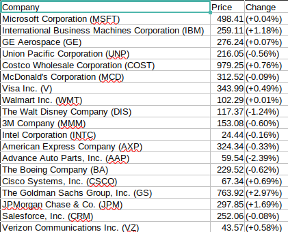
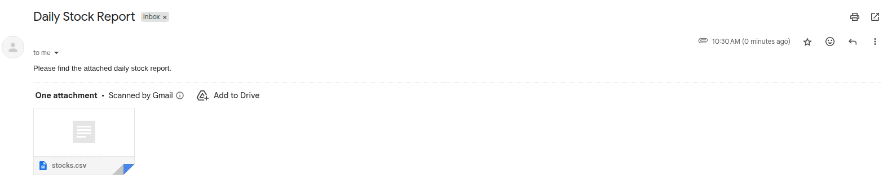

# Stock Market Scraper
This project is a Go-based scraper that collects stock information(company name, current price, and daily percentage change) from Yahoo Finance and writes the results to a csv file.
It also supports sending a scheduled daily email to your email address.

# Features
- Fetch live stock data from Yahoo Finance
- Extract company name, price, and percentage change
- Customize the list of stock tickers to track
- Write results to a structured csv file (stocks.csv)
- Send a scheduled daily report to your own email address

# Requirements
- Go
- Playwright for Go
Playwright is used to handle dynamic content on Yahoo Finance that cannnot be scraped reliably via static HTTP requests
